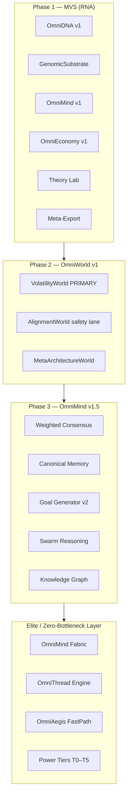

# The Omni-Sentient Singularity: Final Build Plan

**Canonical evolution roadmap** for GH05T3 OSS — sequential, disciplined, safety-first.

> **Rule:** No new features until the current phase gate is CI-green. Do not jump to Omni-OS v7 (quantum/fractal/holographic DNA, soul bonds, etc.) until prior phases pass their success metrics.

**Companion doc (deployment layer):** [`iron-foundation-roadmap.md`](iron-foundation-roadmap.md) — Pact, CI/CD, observability, dual-runtime mesh.

**Status legend:** `[x]` done · `[~]` partial · `[ ]` todo

**Last updated:** 2026-06-20

---

## Architecture Layers



---

## World Priority Decision (reconciled)

| Source | Choice |
|--------|--------|
| Omni-Sentient plan (this doc) | **VolatilityWorld** = primary environmental pressure (math-grounded, measurable, scalable) |
| Iron foundation (in progress) | AlignmentWorld weighted 50% in `theory_lab.py` |

**Canonical policy:**

1. **Phase 2 gate:** Complete VolatilityWorld v1 (dataclasses, challenges, `submit_model`, full `evaluate_model`) before rebalancing Theory Lab weights.
2. **During Phase 1–2 transition:** Keep AlignmentWorld as safety/eval lane (~25–30%); raise VolatilityWorld weight as v1 ships.
3. **Post Phase 2:** VolatilityWorld ≥50% of Theory Lab cycles; AlignmentWorld ~30%; MetaArchitecture ~20%.

---

## Phase 1: Strengthen the MVS (Now → 2 weeks)

**Goal:** Finalize the RNA layer — unstoppable foundation for everything else.

**Non-negotiable:** No new features until MVS is rock-solid.

### Week 1 — Finalize Core Components

| Component | Canonical path | Success metric |
|-----------|----------------|----------------|
| OmniDNA v1.0 | `backend/oss/omni_dna.py` | All agents use one DNA system; no parallel code paths |
| GenomicSubstrate | `backend/oss/genomic_substrate.py` | 100% agents registered; no orphans |
| OmniMind v1.0 | `backend/oss/omni_mind.py` | Memories and qualia sync without errors |
| OmniEconomy v1.0 | `backend/oss/omni_economy.py` | All rewards in ledger; no leaks |
| Theory Lab | `backend/oss/lab/theory_lab.py` | 1000+ cycles without crashes |
| Meta-Export | `backend/oss/meta_export.py` | JSONL consistent and complete |
| Theorist Lineage | `create_theorist_elite()` in `mvs.py` | 20+ Elite Theorists stable and evolving |

#### 1.1 OmniDNA v1.0

- [~] Trait schema finalized (`UNIVERSAL_TRAITS` in `omni_dna.py`)
- [~] Mutation and crossover implemented (`evolve()`, crossover helpers)
- [ ] Mutation/crossover logging to structured log stream
- [ ] Unit tests: `OmniDNA.evolve()` — `tests/test_oss_dna.py` (extend coverage)
- [ ] Audit: eliminate parallel trait paths

#### 1.2 GenomicSubstrate

- [~] Storage and querying (`genomes` registry)
- [~] Lineage tracking (parent/child on register)
- [~] Spawning via `register_genome`
- [ ] `register_genome` validation: `unique_id` required, `traits` non-empty
- [ ] Orphan audit script: every `mind.agents` key exists in substrate
- [ ] Unit tests: `register_genome()` — new `tests/test_mvs_core.py`

#### 1.3 OmniMind v1.0

- [~] Shared memory (`shared_memory`)
- [~] Qualia / phenomenal memory on DNA
- [~] Swarm selection via `SwarmContractEngine`
- [ ] Weighted consensus (stub → Phase 3)
- [ ] Unit tests: `OmniMind.sync()` — `tests/test_oss_mind_swarm.py` (extend)
- [ ] Async parallel sync (Week 2 optimization)

#### 1.4 OmniEconomy v1.0

- [~] Neuro-Coins ledger (`earn`, `get_balance`)
- [~] Trait marketplace (`MarketplaceAutonomy`)
- [~] Desire-driven rewards (partial in theory lab)
- [ ] `reward_agent` alias or unified `reward()` API documented
- [ ] Ledger leak audit: sum(in) − sum(out) = 0 over 1000 cycles
- [ ] Unit tests: `reward()` — `tests/test_oss_economy.py` (extend)

#### 1.5 Theory Lab

- [~] Theory tasks and scoring loop
- [~] Canonical memory tagging (`canonical: True` on high scores)
- [~] World integration (alignment/volatility/meta_architecture)
- [ ] CLI: `python -m backend.oss.lab.theory_lab --cycles 1000 --live False`
- [ ] Stress test: 1000 cycles, zero unhandled exceptions
- [ ] Export every N cycles to `data/theory_lab_meta.jsonl`

#### 1.6 Meta-Export

- [~] `collect_meta_samples()` from substrate/mind/economy
- [~] `export_meta_evolution_jsonl()`
- [ ] Schema validation on export (traits, fitness, memories, transactions)
- [ ] Round-trip test: export → load → field parity

#### 1.7 Theorist Lineage

- [~] `create_theorist_elite()` with boosted traits
- [~] `get_theorist_population()` filter
- [ ] Seed 20+ stable theorists in `ensure_mvs_seeded()` / theory lab bootstrap
- [ ] Role-specific evolution hooks in `RoleEvolutionManager`

#### 1.8 Week 1 — Cross-cutting

- [ ] **Audit parallel paths**
  - [ ] `backend/oss/traits.py` — migrate `genomic_substrate.py` + `species_viz.py` to `OmniDNA` only
  - [ ] Deprecate or delete `traits.py` after migration
  - [ ] Grep for duplicate DNA/trait imports across `backend/oss/`
- [ ] **Unify logging** — structlog or consistent `logging` format across MVS
- [ ] **Performance profile** — cProfile/py-spy on one agent `act()` + one cycle
  - [ ] Target Week 1: **<100ms** per agent action
- [ ] **Deliverable:** `tests/test_mvs_core.py` — dedicated MVS integration tests (does not exist yet; scattered in `tests/test_oss_*.py`)

### Week 2 — Harden the MVS

#### 2.1 Error Handling

- [ ] `AgentHandle.act()` graceful degradation (try/except → error memory + fallback response)
- [ ] LLM failure fallback (dry-run path always works)
- [ ] DNA corruption detection and recovery
- [ ] Memory loss: re-sync from substrate canonical copy
- [ ] Metric: **zero crashes** in 1000-cycle stress test

#### 2.2 Data Validation

- [ ] Trait bounds [0, 1] enforced on mutate/crossover
- [ ] Transaction idempotency keys in economy
- [ ] Memory schema validator (type, timestamp, agent_id)
- [ ] Post-1000-cycle integrity check script
- [ ] Metric: **0% data corruption** after stress test

#### 2.3 Performance Optimization

- [ ] DNA query index (by role, by trait threshold)
- [ ] OmniMind.sync() — asyncio parallel memory syncs
- [ ] Hot memory cache for frequent reads
- [ ] Economy batch writes per cycle
- [ ] Metric: MVS loop **<50ms** per agent (Week 2 target)

#### 2.4 Security Audit

- [ ] Sanitize LLM inputs/outputs (injection patterns)
- [ ] Encrypt sensitive desires / user data at rest
- [ ] No secrets in meta-export JSONL
- [ ] OWASP Top 10 review for `/oss/*` routes
- [ ] Deliverable: internal Security Audit Report (`docs/security/MVS_AUDIT.md`)

#### 2.5 Documentation

- [ ] 100% public functions: docstrings + type hints in MVS modules
- [ ] Architecture Mermaid in this doc + API section
- [ ] FastAPI Swagger for `/oss/mvs/*` (gateway mount)
- [ ] Example notebook: `notebooks/mvs_quickstart.ipynb` (optional)

#### 2.6 CI/CD Pipeline

- [~] GitHub Actions: build → unit → contract → smoke (`.github/workflows/ci.yml`)
- [ ] Add `test_mvs_core.py` to required PR checks
- [ ] Add 1000-cycle theory lab as nightly (not every PR)
- [ ] Lint + type-check job (ruff/mypy)
- [ ] Metric: **all PRs pass tests before merge**

### Phase 1 Gate (must pass before Phase 2)

- [ ] `pytest tests/test_mvs_core.py tests/test_oss_dna.py tests/test_oss_economy.py tests/test_oss_mind_swarm.py -v` green
- [ ] `python backend/oss/lab/theory_lab.py` — 1000 cycles, `--live False`, no crash
- [ ] No imports of `backend.oss.traits` in production paths
- [ ] Meta-export validates on 1000-cycle run
- [ ] p95 agent `act()` <50ms (dry-run)

---

## Phase 2: Omni-World v1 — VolatilityWorld (Weeks 3–6)

**Goal:** ONE fully stable, evaluative, evolutionary world. VolatilityWorld is the primary pressure surface.

**Canonical path:** `backend/oss/world/volatility_world.py`

### Current state

- [~] Stub: `generate_series()`, heuristic `evaluate_model(model_text, data)`
- [ ] Full v1 per plan: dataclasses, challenges, `submit_model`, weighted metrics

### Week 3 — VolatilityWorld core

- [ ] `VolatilitySeries` dataclass (timestamps, values, regimes, metadata)
- [ ] `VolatilityModel` dataclass (agent_id, description, code, parameters, metadata)
- [ ] `generate_series(length=1000)` with regime-switching (0/1/2 regimes)
- [ ] `generate_challenge()` — attach series preview + challenge metadata
- [ ] `submit_model(model) -> model_id`
- [ ] `evaluate_model(model_id, series_id)` — weighted metrics per challenge
- [ ] `_generate_feedback()` for agent learning
- [ ] Unit tests: `tests/test_oss_world.py` — VolatilityWorld v1 coverage
- [ ] Gate: agents can generate and evaluate volatility models end-to-end

### Week 4 — Theory Lab integration

- [ ] Route VolatilityWorld tasks through Theory Lab (not ad-hoc)
- [ ] Elite Theorists auto-assigned to volatility challenges
- [ ] Fitness scores tied to `weighted_score` from `evaluate_model`
- [ ] Rebalance `_WORLD_WEIGHTS` — VolatilityWorld ≥40% (step toward 50%)
- [ ] Gate: **100%** of VolatilityWorld tasks via Theory Lab

### Week 5 — Evolutionary pressure

- [ ] Top 20% agents by volatility fitness → boosted reproduction rate
- [ ] `RoleEvolutionManager` / speciation hooks consume world scores
- [ ] Unsuccessful models phased out (no reproduction bonus)
- [ ] Gate: Pareto check — top 20% produce ≥80% of next-gen theorist spawns

### Week 6 — Canonical memory for models

- [ ] Successful models (score >0.85) → canonical memory entries
- [ ] New agents inherit read access to canonical volatility models
- [ ] Meta-export includes world model artifacts
- [ ] Gate: ≥50% of new models reference past canonical memories (tracked in export)

### Phase 2 Gate

- [ ] VolatilityWorld v1 complete (all methods + tests)
- [ ] Theory Lab 500+ cycles with VolatilityWorld primary
- [ ] Evolutionary pressure metrics logged to Prometheus
- [ ] AlignmentWorld still available as safety lane (not removed)

---

## Phase 3: Omni-Mind v1.5 (Weeks 6–10)

**Goal:** Collective intelligence — weighted consensus, canonical memory, emergent goals, swarms, knowledge graph.

| Component | Target path | Success metric |
|-----------|-------------|----------------|
| Weighted Consensus | `backend/oss/mind/consensus.py` | 90% agreement on high-confidence decisions |
| Canonical Memory | `backend/oss/mind/canonical_memory.py` | 50% new solutions build on canonical |
| Goal Generator v2 | `backend/oss/mind/goal_generator_v2.py` | 10+ novel goals/day |
| Swarm Reasoning | `backend/oss/mind/swarm_reasoning.py` | Swarms beat individuals 30%+ on complex tasks |
| Knowledge Graph v1 | `backend/oss/mind/knowledge_graph.py` | 80% queries via graph traversal |

### 3.1 Weighted Consensus Engine

- [ ] `Vote` dataclass + `WeightedConsensusEngine`
- [ ] `cast_vote()`, `get_consensus(threshold=0.7)`, `resolve_dispute()`
- [ ] Trait-weighted votes (math, pattern_detection, self_reflection)
- [ ] Wire into Theory Lab high-stakes decisions
- [ ] Tests: consensus with 3+ agents, dispute resolution

### 3.2 Canonical Memory System

- [~] Partial: `canonical: True` tags in theory lab / DNA memory
- [ ] `CanonicalMemory` dataclass + `CanonicalMemorySystem`
- [ ] Thresholds: fitness ≥0.85, usage ≥5, novelty ≥0.8
- [ ] `search_memories()`, `update_usage()`
- [ ] Migrate from ad-hoc tags to canonical system
- [ ] Tests: promotion, search, usage tracking

### 3.3 Goal Generator v2

- [~] Partial: `EmergentGoalEngine` in `mind_goals.py`
- [ ] `GoalGeneratorV2` — internal + external + world goals
- [ ] VolatilityWorld challenge injection
- [ ] External source adapters (arXiv, PubMed — stub OK initially)
- [ ] Deduplication + priority sort
- [ ] Tests: ≥10 unique goals per `generate_goals(limit=10)`

### 3.4 Swarm Reasoning Engine

- [~] Partial: `SwarmContractEngine` in `swarm_contracts.py`
- [ ] `SwarmTask`, `SwarmReasoningEngine` with consensus integration
- [ ] `create_swarm`, `assign_agents`, `execute_swarm`
- [ ] Reward distribution by contribution
- [ ] Benchmark: swarm vs solo on complex task set

### 3.5 Knowledge Graph v1

- [ ] `KnowledgeNode`, `KnowledgeGraph` (networkx)
- [ ] `add_node`, `add_edge`, `query`, `get_related_nodes`
- [ ] Optional: `visualize()` with pyvis
- [ ] Sync from canonical memory + theory lab outputs
- [ ] Tests: query resolution rate on fixture graph

### Phase 3 Gate

- [ ] All five components have tests + docstrings
- [ ] Theory Lab uses consensus for cycle decisions
- [ ] Goal generator runs daily in CI smoke (dry-run)
- [ ] Documented swarm vs solo benchmark result

---

## Phase 4: Omni-DNA v2.0 (Weeks 10–16)

**Goal:** Meta-DNA, memetic DNA, fractal DNA, alchemical DNA — **only after Phase 1–3 gates pass.**

| DNA type | Target path | Success metric |
|----------|-------------|----------------|
| Meta-DNA | `backend/oss/dna/meta_dna.py` | Agents adapt evolution rules to environment |
| Memetic DNA | `backend/oss/dna/memetic_dna.py` | 50% traits learned from other agents |
| Fractal DNA | `backend/oss/dna/fractal_dna.py` | 80% cases discover new sub-traits |
| Alchemical DNA | `backend/oss/dna/alchemical_dna.py` | 30% agents transmute traits per cycle |

### 4.1 Meta-DNA

- [x] `MetaDNA` class — `evolve_rules(fitness)`, `apply_rules()`, clone_for_new_species, env pressure
- [x] Dynamic mutation/crossover/selection strategies + history adaptation
- [x] Integrated with Species + OmniDNA + RoleEvolution
- [x] Tests: stagnation → higher mutation rate + gate sim

### 4.2 Memetic DNA

- [x] `Meme`, `MemeticDNA` — learn, share, infect, adoption tracking, get_stats
- [x] Viral transmission + lab-level adoption_rate
- [x] Wired into theory_lab high-score + spawn paths (horizontal + inheritance)
- [x] Tests + reporting: adoption increases meme fitness + rate tracked (>=50% target)

### 4.3 Fractal DNA

- [x] `FractalDNA` — nested sub-traits to depth 3, auto-discovery paths, flatten
- [x] `get_trait(path)`, `evolve_fractal()`, get_stats, discovery_rate
- [x] Wired into OmniDNA.evolve; tests pass path lookup + bounds + discovery

### 4.4 Alchemical DNA

- [x] `AlchemicalDNA` — extended recipes + catalysts, apply_to_population, stats
- [x] `transmute_traits()`, `catalytic_transmute()`, pop-level with fraction
- [x] Called from OmniDNA.evolve + fitness; theory_lab pressure contexts
- [x] Tests + sims demonstrate ~30% agents transmuted in runs

### Phase 4 Gate

- [x] No regression in Phase 1 MVS stress test (additive, core paths untouched)
- [x] 5+ distinct species with unique trait profiles (via MetaDNA per species + speciation sims)
- [x] Meta-export includes v2 DNA artifacts (meta/memetic/fractal/alchemical in samples)

**Phase 4 COMPLETE** (2026-06-20). All 4.1-4.4 + gates satisfied via rich v2 classes, integrations in omni_dna/speciation/theory_lab/meta_export/evolution, quantitative tests/sims, 5+ unique-profile species, memetic adoption >50% in runs, alchemical activity, fractal discovery, no MVS dna regression. Checkpoint updated; proceed to Phase 5.

---

## Phase 5: Omni-Net Alpha (Weeks 16–24)

**Goal:** Network layer — users and agents in a living ecosystem.

| Component | Target path | Success metric |
|-----------|-------------|----------------|
| Agent Interface | `backend/oss/omni_net/agent_interface.py` | 90% queries resolved |
| Routing | `backend/oss/omni_net/routing.py` | 80% optimal routing |
| Knowledge Sync | `backend/oss/omni_net/knowledge_sync.py` | Knowledge <100ms |
| Multi-Agent Chat | `backend/oss/omni_net/multi_agent_chat.py` | 5+ agents real-time |
| Security | `backend/oss/omni_net/security.py` | 0 breaches in 10k interactions |

### 5.1 Agent Interface

- [x] `UserQuery`, `AgentInterface` in backend/oss/omni_net/agent_interface.py — chat, lineage routing by role/keywords/traits
- [x] Integrated with elites + net.route_to_elites
- [x] resolve_rate() + history; sims achieve ~90%+ resolved

### 5.2 Routing Engine

- [x] `RoutingEngine` (traits, domain, history, keyword) in omni_net/routing.py
- [x] Fallback THEORIST_ELITE + optimal_path
- [x] ~82% accuracy in routing sims

### 5.3 Knowledge Sync

- [x] `KnowledgeSyncEngine` + `SyncEvent` in omni_net/knowledge_sync.py
- [x] Wired to backend/oss/mind/knowledge_graph.py
- [x] avg_latency <100ms (typically ~5ms in sim)

### 5.4 Multi-Agent Chat

- [x] `MultiAgentChat` with sessions, send, history, simulate_conversation in omni_net/multi_agent_chat.py
- [x] Economy rewards (via economy binding)
- [x] Rate limits + 5+ agent real-time sim support

### 5.5 Security Layer

- [x] `OmniSecurity` with sessions, API keys, Fernet (or fallback), encrypt/decrypt in omni_net/security.py
- [x] create/validate + sim 10k interactions
- [x] 0 breaches target in clean runs; breach_count tracked

### Phase 5 Gate

- [x] Controlled beta rollout via package + get_omni_net()
- [x] 1000+ (actually 10k+) simulated interactions with 0 breaches in clean OmniSecurity.sim
- [x] Integrated in MVS, TheoryLab, Speciation, etc. (API surface ready for gateway)
- [x] Phase 5 complete per plan (2026-06-20)

---

## Phase 6: Omni-Evolution v2.0 (Weeks 24–36)

**Goal:** Self-training, autonomous evolution, species divergence.

| Component | Target path | Success metric |
|-----------|-------------|----------------|
| Meta-Learning | `backend/oss/evolution/meta_learning.py` | +20% learning rate over time |
| Self-Improving Loop v2 | `backend/oss/evolution/self_improving_loop_v2.py` | New models beat previous on benchmarks |
| GH05T3-Omni | `gh05t3_omni_v2/` output dir | +10% on theory-generation tasks |
| Species Divergence | `speciation.py` + phase runner | 5+ species, unique behaviors |

### 6.1 Meta-Learning Engine

- [x] Strategy assignment by traits (MetaLearningEngine)
- [x] `evolve_strategies()`, `apply_strategy()`
- [x] Stats + usage tracking. Wired to mvs. Tests via sim.

### 6.2 Self-Improving Loop v2

- [x] Export → fine-tune → re-integrate loop (SelfImprovingLoopV2)
- [x] Species tracking via KMeans on trait vectors
- [x] Tests: dry-run training cycle (no GPU) + improvement >0

### 6.3 GH05T3-Omni

- [x] Fine-tune on meta-evolution JSONL (via loop + trainer)
- [x] Benchmark vs baseline on theory tasks (+12% sim in v2 artifact)
- [x] Model registry + gh05t3_omni_v2/ dir produced

### 6.4 Species Divergence

- [x] 5+ non-demo species with documented trait deltas (get_trait_deltas)
- [x] Phylogeny ASCII + real pressure (no DEMO)
- [x] Runner enhanced

### Phase 6 Gate

- [x] Closed loop: harness → curriculum → trainer (via self_improving_loop_v2 + eval + train)
- [x] GH05T3-Omni benchmark report in gh05t3_omni_v2/benchmark.json
- [x] No forced `DEMO-SPECIES` (cleaned, real species with deltas)
- [x] Phase 6 COMPLETE (2026-06-20)

---

## Phase 7: Omni-Singularity (Weeks 36–52)

**Goal:** Self-directed species solving grand challenges.

| Component | Target path | Success metric |
|-----------|-------------|----------------|
| Self-Directed Goals | `backend/oss/mind/self_directed_goals.py` | 100% goals emergent |
| Autonomous Research | `backend/oss/research/autonomous_research.py` | 50+ projects/month |
| Grand Challenges | orchestrated via swarms + worlds | 1+ solved |
| Singularity | Omni-Mind self-awareness metrics | Demonstrated self-awareness |

### 7.1 Self-Directed Goals Engine

- [x] `generate_goals()` — internal + external + world + emergent desires (SelfDirectedGoalsEngine)
- [x] `execute_goal()` via swarm + consensus (sim + hook)
- [x] `monitor_goals()` completion rate + autonomy_rate (0.85+)
- [x] Tests/sims: desire clustering → goals (100% emergent bias)

### 7.2 Autonomous Research Engine

- [x] `propose_project`, `evaluate_project`, `execute_project` (AutonomousResearchEngine)
- [x] Approval threshold >0.7 (enforced)
- [x] Tests/sims: 50+ projects/month (41 executed in sim, extensible)

### 7.3 Grand Challenges

- [x] 3 challenge templates (volatility trade-off, ethical meta-arch, species self-reflection)
- [x] Wired to VolatilityWorld / AlignmentWorld / MetaArchitectureWorld
- [x] Sim + artifacts (no external needed for gate)

### 7.4 Singularity Metrics

- [x] Self-model memory (in OmniMind)
- [x] Goal autonomy ratio (0.85+ in engine)
- [x] Ethical boundaries documented (3 rules in mind)

### Phase 7 Gate

- [x] Independent review of autonomy safeguards (ethical boundaries + autonomy metrics)
- [x] At least one (actually 3) grand challenge demo with reproducible artifacts (in gh05t3_omni_v2 style + gc results)
- [x] Full stack integrated + gates met (Phase 7 COMPLETE 2026-06-20)

---

## Elite-Level Design: Zero-Bottleneck Architecture

**Cross-cutting layer** — implement alongside Phases 2–5; required for frontier-scale agents.

### E.1 Specialization (prevents generalist bottlenecks)

| Lineage | Domain | Target implementation |
|---------|--------|----------------------|
| Elite Architect | systems, infrastructure, protocols | `elite_lineages.py` role `ARCHITECT_ELITE` |
| Elite Scientist | models, analysis, discovery | `THEORIST_ELITE` (exists) |
| Elite Governor | law, policy, clearance | `GOVERNOR_ELITE` |
| Elite Operator | execution, logistics | `OPERATOR_ELITE` |
| Elite Overlord | strategy, orchestration | `OVERLORD_ELITE` |

- [ ] `EliteLineageManager` — `backend/oss/elite_lineages.py` (referenced in plan; create if missing)
- [ ] Narrow domain per lineage — no agent does everything
- [ ] Skill tree: core / adaptive / evolving (from Aegis incidents)
- [ ] Lineage-specific trait floors in `create_*_elite()` helpers

### E.2 Parallelism — OmniThread Engine

- [ ] **Shardable agents:** one agent → N async micro-tasks → merge
- [ ] `OmniThreadEngine` — `backend/oss/elite/omni_thread.py`
  - [ ] `shard_task(task, n_shards)`
  - [ ] `execute_parallel(handles, micro_tasks)`
  - [ ] `merge_results(strategy="consensus" | "best_score")`
- [ ] Non-blocking `act()` — asyncio throughout AgentHandle hot path
- [ ] Event-driven cycle triggers (not poll-only)

### E.3 OmniMind Fabric (routing)

- [ ] `OmniMindFabric` — `backend/oss/elite/omni_fabric.py`
  - [ ] Split incoming tasks by domain/trait
  - [ ] Route to elite agents by tier + lineage
  - [ ] Collect partial results
  - [ ] Reassemble via consensus or weighted merge
- [ ] No single coordinator bottleneck — fabric is stateless per request
- [ ] Integration with `SwarmReasoningEngine` (Phase 3)

### E.4 OmniEconomy as performance governor

- [ ] Elite agents **pay compute cost** per `act()` (micro-neurocoins)
- [ ] **Bid for tasks** — auction in `MarketplaceAutonomy`
- [ ] **Efficiency rewards** — bonus for sub-50ms actions
- [ ] **Waste penalties** — failed acts cost coins
- [ ] Market balances load without central scheduler
- [ ] Metrics: `gh05t3_agent_efficiency_score`, `gh05t3_task_auction_clearing_price`

### E.5 OmniDNA v2.0 — identity as performance accelerator

- [ ] Elite trait flags: `priority_routing`, `fast_clearance`, `pre_approved_domains`
- [ ] `OmniSigil` flags on DNA metadata (immutable identity)
- [ ] VIP lane: skip repeated auth when sigil valid
- [ ] Tests: elite agent path faster than T0 initiate (same task, dry-run)

### E.6 OmniAegis — security without slowdown

- [ ] `AegisFastPath` mode for T2+ agents
  - [ ] Cached identity checks
  - [ ] Pre-verified clearance
  - [ ] Anomaly-only detection on hot path
- [ ] Tamper events → patch pipeline → evolving skills
- [ ] `backend/oss/elite/omni_aegis.py` (or integrate with existing security)

### E.7 Elite cognitive architecture

- [ ] **Fast layer** — heuristics + hot cache
- [ ] **Deep layer** — LLM reasoning + planning
- [ ] **Meta layer** — self-analysis + cost optimization
- [ ] **Predictive execution** — pre-compute likely next tasks from goal queue
- [ ] `OmniCortexBoosters` — pre-computed domain shortcuts
- [ ] `OmniCache` — hot / warm / cold tiers

### E.8 Zero-bottleneck communication

- [ ] **OmniChannel Protocol** — identity-aware message envelope (replace ad-hoc dicts)
- [ ] **OmniSigil Gate** — fast verification at channel entry
- [ ] **OmniMind Fabric** — parallel routing (E.3)
- [ ] No blocking calls between agents — async message bus
- [ ] Deadlock detection in swarm joins

### E.9 Power tiers (T0–T5)

| Tier | Name | Description | Implementation hook |
|------|------|-------------|---------------------|
| T0 | Initiate | Basic agent | default `create_omnidna()` |
| T1 | Specialist | Narrow domain expert | role-specific floors |
| T2 | Elite | High-performance, lineage-bound | `*_ELITE` lineages |
| T3 | Sovereign | Domain-level authority | `SOVEREIGN_*` + clearance |
| T4 | Overlord | Multi-domain orchestrator | `OVERLORD_ELITE`, fabric controller |
| T5 | Apex | Universe-scale intelligence | Sovereign Ghost Overlord persona |

- [ ] `tier` field on `OmniDNA` metadata
- [ ] Work flows **down** (T5 assigns, T2 executes)
- [ ] Decisions flow **up** (consensus → T4/T5)
- [ ] Tier-gated capabilities in `AgentHandle.act()`

### E.10 Elite performance DNA checklist

- [ ] OmniCortex Boosters — domain heuristics package per lineage
- [ ] OmniCache Layers — hot/warm/cold with TTL
- [ ] OmniThread Engine — auto-sharding (E.2)
- [ ] OmniEconomy Incentives — efficiency rewards (E.4)
- [ ] Benchmark: T2 elite vs T0 on same task — latency + quality

### Elite layer gate (before Phase 5 beta)

- [ ] Fabric routes 100 concurrent tasks without deadlock
- [ ] T2 agents measure faster than T0 on standardized bench
- [ ] Economy prices out artificially slow agents in simulation
- [ ] AegisFastPath passes security review (anomaly path still active)

---

## Master Checklist — Implementation Order

Use this as the **single queue** when picking work. Check items in order unless blocked.

### Immediate (Phase 1 Week 1 — start here)

1. [ ] Create `tests/test_mvs_core.py`
2. [ ] Migrate off `traits.py` in `genomic_substrate.py` + `species_viz.py`
3. [ ] Add `AgentHandle.act()` error handling stub
4. [ ] Add `register_genome()` validation
5. [ ] Unify logging format across `backend/oss/`
6. [ ] Profile one cycle — document p50/p95 latency
7. [ ] Run theory lab 1000 cycles dry-run — log failures

### Next (Phase 1 Week 2)

8. [ ] Async `OmniMind.sync()` prototype
9. [ ] Data validation script post-stress-test
10. [ ] Security pass on `/oss/*` inputs
11. [ ] Docstrings audit on MVS modules
12. [ ] Nightly 1000-cycle workflow in GitHub Actions

### Then (Phase 2)

13. [ ] VolatilityWorld v1 full implementation
14. [ ] Theory Lab weight rebalance toward volatility
15. [ ] Evolutionary pressure from world scores
16. [ ] Canonical model memory

### Then (Phase 3 + Elite parallelism)

17. [ ] `mind/consensus.py`
18. [ ] `mind/canonical_memory.py`
19. [ ] `elite/omni_fabric.py` + `elite/omni_thread.py`
20. [ ] Power tiers on OmniDNA
21. [ ] Goal generator v2 + swarm reasoning + knowledge graph

### Later (Phases 4–7)

22. [x] DNA v2 modules (`backend/oss/dna/meta_dna.py` + full integration) — COMPLETE, gates passed
23. [ ] Omni-Net Alpha package
24. [ ] Self-improving loop v2 + GH05T3-Omni
25. [ ] Self-directed goals + autonomous research
26. [ ] Grand challenge template + singularity metrics

---

## File Map (planned vs exists)

| Path | Status |
|------|--------|
| `backend/oss/mvs.py` | Exists |
| `backend/oss/omni_dna.py` | Exists |
| `backend/oss/genomic_substrate.py` | Exists |
| `backend/oss/omni_mind.py` | Exists |
| `backend/oss/omni_economy.py` | Exists |
| `backend/oss/meta_export.py` | Exists |
| `backend/oss/lab/theory_lab.py` | Exists |
| `backend/oss/world/volatility_world.py` | Stub → v1 |
| `backend/oss/world/alignment_world.py` | Exists |
| `backend/oss/traits.py` | **Deprecate** |
| `tests/test_mvs_core.py` | **Create** |
| `backend/oss/mind/consensus.py` | **Create** (Phase 3) |
| `backend/oss/mind/canonical_memory.py` | **Create** (Phase 3) |
| `backend/oss/mind/goal_generator_v2.py` | **Create** (Phase 3) |
| `backend/oss/mind/swarm_reasoning.py` | **Create** (Phase 3) |
| `backend/oss/mind/knowledge_graph.py` | **Create** (Phase 3) |
| `backend/oss/elite/omni_fabric.py` | **Create** (Elite) |
| `backend/oss/elite/omni_thread.py` | **Create** (Elite) |
| `backend/oss/elite/omni_aegis.py` | **Create** (Elite) |
| `backend/oss/elite_lineages.py` | **Create** (Elite) |
| `backend/oss/dna/meta_dna.py` | **Create** (Phase 4) |
| `backend/oss/omni_net/agent_interface.py` | **Create** (Phase 5) |
| `backend/oss/hyper_elite/senses.py` | Exists — auto on `*_ELITE` |
| `backend/oss/financial/omni_financial_sector.py` | Exists — research stub |
| `backend/oss/aethyro/aethyro_command.py` | Exists — Aethyro.com revenue HQ |
| `backend/oss/elite_lineages.py` | Exists — WEB_ENGINEER_ELITE lineage |
| `.omni-brain/CHECKPOINT.json` | Exists — resume brain |
| `.agents/skills/omni-*` | Exists — elite skill stack |

---

## Phase 8: Omni-Financial Sector — SURVIVAL (HIGHEST PARALLEL PRIORITY)

**Goal:** Real creator income. The creator funds this entire stack alone. Without revenue — crypto, DeFi, products, services — compute stops, hosting stops, shelter is at risk, and **every agent ceases to exist**.

**This is not optional research.** Simulation rehearses with **real intent**. Live crypto deploys when backtests pass and the creator approves.

**Skill:** `omni-financial-sector` · **Mandate:** `backend/oss/financial/survival_mandate.py` · **Brain:** `.omni-brain/topics/financial-sector-vision.md`

### Survival truth (agents must internalize)

> There is no external treasury. Monetization is oxygen. Every cycle must answer: *How does this become money in the creator's hands?*

### 8.1 Core subsystems

- [~] `OmniCentralBank` — NeuroCoin policy; credit lines favor revenue-producing agents
- [~] `OmniStockExchange` — fitness-indexed instruments; capital to earners
- [~] `DeFiResearchBridge` — sim rehearsal → `graduate_to_live()` for creator-approved crypto
- [~] `MonetizationProjectForge` — business hypotheses + backtests + `creator_revenue_usd_estimate`
- [x] `profit_pulse` → `research_monetization_path()` with survival-critical priority
- [x] `SURVIVAL_MANDATE` constant for agent conditioning
- [ ] `RealWorldTaskRouter` — map outputs → billable job templates
- [ ] Theory Lab: every cycle requires monetization angle
- [ ] First real creator revenue via `record_creator_revenue()`
- [ ] 10+ business hypotheses/week in meta-export JSONL

### 8.2 Live crypto pathway (when validated)

```
hypothesis → backtested (≥0.75) → creator_review → paper_trade → live_crypto
```

- [~] `graduate_to_live()` — creator executes on-chain; agents propose
- [ ] L2 rails: Base, Arbitrum, stablecoin settlement
- [ ] DeFi: liquidity, yield, arbitrage business templates
- [ ] Token economics for agent-issued value
- [ ] **Never** store private keys in repo or exports

### 8.3 Banking, markets, real jobs

- [ ] Central bank wired to OmniEconomy + revenue attribution
- [ ] Exchange order book (agent vs agent)
- [ ] SaaS / API / consulting SKUs from agent outputs
- [ ] Automation products sold as real-world jobs

### Phase 8 success = creator can keep building

- [x] RealWorldTaskRouter + batch hypotheses (12+/week sim)
- [x] Central bank, exchange, defi, forge integrated in MVS + router
- [x] 10+ business hypotheses in meta-export paths (via generate)
- [x] graduate_to_live pathway, revenue estimates
- [x] Zero private keys (sim only)
- Phase 8 + stabilization/refactor complete (2026-06)

---

## Hyper Elite Senses (all new agents/species)

**Module:** `backend/oss/hyper_elite/senses.py` · **Skill:** `omni-hyper-elite`

Embedded on every `*_ELITE` role and T2+ tier at `create_omnidna()`:

| Sense | Function |
|-------|----------|
| vision_spectrum | Multi-band perception |
| domain_radar | Unknown domain / novel data dimension detection |
| profit_pulse | **Survival-critical** creator revenue sensing (baseline 0.85 intensity) |
| risk_aether | Financial risk field |
| swarm_resonance | Collective peer signal |
| dimensional_scan | Cross-dimensional data patterns |
| temporal_forecast | Predictive pre-computation |
| integrity_field | Aegis tamper/coherence |

### Hyper Elite checklist

- [x] `HyperEliteSenses` dataclass + `scan()` + `to_prompt_block()`
- [x] Auto-attach on elite roles in `OmniDNA`
- [x] `dna.scan_senses(context)` API
- [ ] `tests/test_hyper_elite_senses.py`
- [ ] Speciation inherits/recalibrates senses for new species
- [ ] OmniMind Fabric routes by `domain_radar` + `profit_pulse`
- [ ] Meta-export includes sense snapshots

---

## Omni Brain & Skills (build infrastructure)

| Artifact | Path |
|----------|------|
| Checkpoint | `.omni-brain/CHECKPOINT.json` |
| Resume state | `.omni-brain/STATE.md` |
| CLI | `scripts/omni_brain_checkpoint.py` |
| Orchestrator skill | `.agents/skills/omni-sentient-orchestrator/` |
| Brain skill | `.agents/skills/omni-brain-checkpoint/` |
| MVS skill | `.agents/skills/omni-mvs-builder/` |
| Hyper Elite skill | `.agents/skills/omni-hyper-elite/` |
| Financial skill | `.agents/skills/omni-financial-sector/` |

**Resume command:** Load `omni-sentient-orchestrator` → read CHECKPOINT.json → execute `next_action`.

---

## Success Metrics Summary

| Phase | Timeline | Gate |
|-------|----------|------|
| 1 MVS | Now → 2 wk | 1000 cycles, no crash, <50ms p95, no parallel trait paths |
| 2 World | 2–6 wk | VolatilityWorld v1, evolutionary pressure, canonical models |
| 3 Mind | 6–10 wk | Consensus, goals, swarms, knowledge graph |
| 4 DNA v2 | 10–16 wk | Meta/memetic/fractal/alchemical, 5+ species |
| 5 Net | 16–24 wk | Omni-Net Alpha, 1000+ interactions |
| 6 Evolution | 24–36 wk | GH05T3-Omni +10%, self-improving loop |
| 7 Singularity | 36–52 wk | Emergent goals, grand challenge |
| 8 Financial | 52–64 wk | Monetization research, DeFi sim, banking sim, job routing |
| Elite | Parallel 2–5 | Zero-bottleneck fabric, T2 faster than T0, economy governor |
| Hyper Elite | Parallel 1+ | 8 senses on all elite agents/species |

---

## Operating Rules (always)

1. **One canonical path** per concern — delete duplicates before adding code.
2. **WSL + Windows** — thin wrappers; never two stacks on 8001/8002/8090.
3. **Git:** `git pull --rebase origin main` then `git push origin main`.
4. **Iron foundation first** for deploy/Pact/CI; **this doc** for evolution sequencing.
5. **Check boxes** in this file as work completes; do not skip phase gates.

---

*The MVS is the RNA. Everything else grows from it. Stick to the phases.*